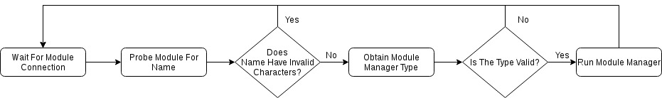
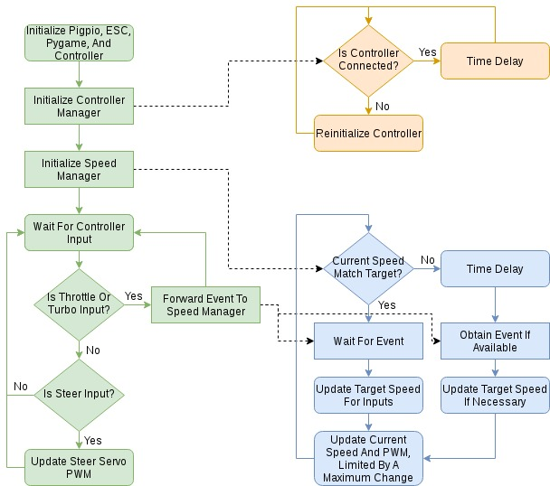
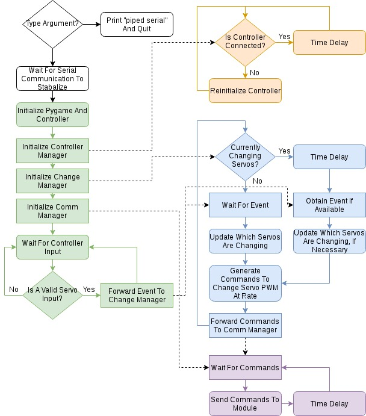

# MRV-RAM
#### Modular Remote Vehicle - Robotic Arm Module
#### Team The Might Be Heisenberg
#### UAH EE 494 Senior Design

## Installation
This has already been installed on the MRV, though these were the steps taken:
1. Download this repository into `/usr/local/` on the MRV and change the folder name to `MRV`.
2. Add the following lines to `/etc/rc.local`:
```
pigpiod &
/usr/local/MRV/ModuleCommv2.py &
/usr/local/MRV/PS3RCv2.py &
```

## File overview
- [LICENSE](LICENSE) MIT license for this repository, be sure to bundle this with your project if you copy any code
- [PS3Mapping](PS3Mapping) List of PS3 controller inputs t their resective pygame values
- [PS3RCv2.py](PS3RCv2.py) Rewrite of original MRV code. Handles car control using the PS3 controller
- [ModuleCommv2.py](ModuleCommv2.py) Rewrite of original MRV code. Handles communication between MRV and modules, as well as executing module specific code
- modules
  - MDM
    - [MDM](modules/MDM/MDM) Recreation of MDM manager code. Acts as new manager for original MDM as well as demo code for piped serial manager type
  - RAM
    - [RAM](modules/RAM/RAM) RAM manager code
    - AVR
      - [main.c](modules/RAM/AVR/main.c) Main C file for RAM Arduino
      - [main.h](modules/RAM/AVR/main.h) Header file for main.c
      - [serialIO.c](modules/RAM/AVR/serialIO.c) Simple serial handler for Arduino
      - [serialIO.h](modules/RAM/AVR/serialIO.h) Header file for serialIO.c
      - [Makefile](modules/RAM/AVR/Makefile) Allows for easy compiling of RAM arduino code with `make` and upload with `make deploy`

## Coding your own module manager
There are a few requirements to consider when making a module manager:
- First, ModuleCommv2.py can only detect serial USB devices, this shouldn't be an issue if you're just communicating over serial to an arduino or the like, though if you need more control of the usb interface you may need to have your device act as a usb serial for the initial connection.
- Secondly, when ModuleCommv2.py sends the binary string "Module?\n" over serial, the module should respond with it's "name". This name is directly connected to the module path in [modules](modules/) as well as the module manager executable file. For example, the original metal detecting module has the name MDM, so the path to it's module manager is modules/MDM/MDM
- Thirdly, The module manager's executable must respond to the "type" argument with either "piped serial" or "full serial" and then immediately exit.
- The [MDM module manager](modules/MDM/MDM) acts as demonstrational code for the piped serial manager type and has more details

## Process flow diagrams
### ModuleCommv2.py


### PS3RCv2.py


### RAM


